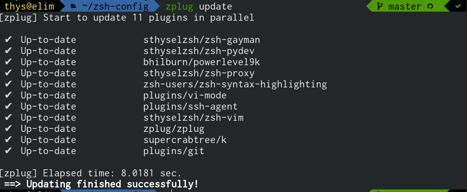

# zsh config


This config uses zplug and installs a number of plugins from
omz, prezto and zuers.

## Install 

Install zsh

```
$sudo pacman -S zsh zsh-completions
```

Clone this repository and link the dots to ${HOME}


```
ln -s zsh-config/dotzshrc ~/.zshrc
```

This config will test for the existence of zplug and install it if needs be.
zplug will manage all plugins.


Update plugins occationally:



